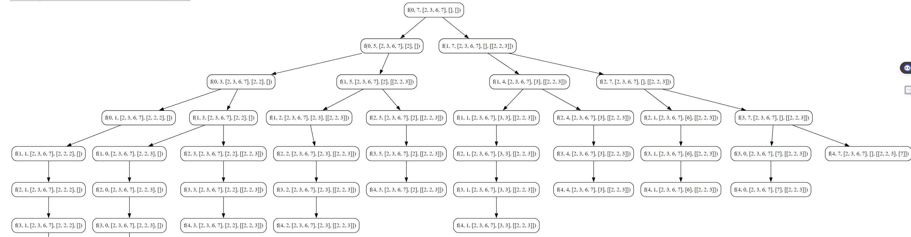

## Combination Sum I
Given an array of **distinct** integers `candidates` and target integer `target`, return a list of all ***unique combinations*** of `candidates` where the chosen numbers sum to `target`. You ma return the combination in **any order**.

The **same** number may be chosen from `candidates` an **unlimited number of times.** Two combinations are unique if the frequency of  at least one of the chosen numbers is different.

**Example**
```
Input: candidates = [2,3,6,7], target = 7
Output: [[2,2,3], [7]]
Explanation:
2 and 3 are candidates, and 2 + 2 + 3 = 7. Note that 2 can be used multiple times.
7 is a candidate, an 7 = 7.
These are the only two combinations.
```

### Objective

Find all unique combinations of elements from an array that sum up to a given target.

**Key Steps**

1. **Initialization**
    
    - Initialize an array, `arr`, with elements `[2, 3, 6, 7]`.
    - Set the target sum, `target`, to `7`.
    - Initialize an empty 2D slice, `ans`, to store unique combinations.
    - Initialize an empty slice, `ds`, to represent the current combination being considered.
2. **Base Case**
    
    - If the current index `index` reaches the length of the array, check if the current combination sums up to the target.
    - If so, create a copy of the current combination `ds` and append it to the result `ans`.
3. **Recursive Exploration**
    
    - If the current element in the array is less than or equal to the remaining target, include the element in the current combination.
    - Recursively call the function with the updated index, reduced target, array, updated combination, and result slice.
    - Remove the last element from the combination `ds` to backtrack and explore other possibilities.
    - Continue the exploration by skipping the current element and moving to the next index.
4. **Result**
    
    - Print the original array `arr`.
    - Print the resulting 2D slice `ans` containing all unique combinations.
### Code
**Go**
```go
package subseq

import (
	"fmt"
)

func CombinationSum() {
	fmt.Println("Combination Sum I Tutorial")
	var arr = []int{2, 3, 6, 7}
	var target int = 7
	var ans [][]int
	var ds []int

	// calling function
	DoCombinationSum1(0, target, &arr, ds, &ans)
	fmt.Println(ans)

}

func DoCombinationSum1(index int, target int, arr *[]int, ds []int, ans *[][]int) {
	if index == len((*arr)) {
		if target == 0 {
			dsCopy := make([]int, len(ds))
			copy(dsCopy, ds)
			*ans = append(*ans, dsCopy)
		}
		return
	}

	if (*arr)[index] <= target {
		ds = append(ds, (*arr)[index])
		DoCombinationSum1(index, target-(*arr)[index], arr, ds, ans)
		ds = (ds)[:len(ds)-1]
	}

	DoCombinationSum1(index+1, target, arr, ds, ans)

}
```

**Python**
```python
def do_combination_sum1(ind, target, arr, ds, ans):
    if ind == len(arr):
        if target == 0:
            ans.append(ds.copy())
        return

    if arr[ind] <= target:
        ds.append(arr[ind])
        do_combination_sum1(ind, target-arr[ind], arr, ds, ans)
        ds.pop()

    do_combination_sum1(ind+1, target, arr, ds, ans)


arr = [2, 3, 6, 7]
target = 7
ds = []
ans = []

do_combination_sum1(0, target, arr, ds, ans)
print(ans)
```
### Algorithmic Complexity Analysis

#### Time Complexity:
The time complexity of the provided code can be analyzed as follows:

- The function `DoCombinationSum1` is called for each element in the array, and for each element, it makes recursive calls.
- The recursion explores all possible combinations, considering both including and excluding each element.
- In the worst case, the number of recursive calls will be exponential.
- The time complexity is dominated by the number of recursive calls and can be expressed as \(O(2^n)\), where \(n\) is the length of the input array.

#### Space Complexity:
The space complexity is determined by the space used in the function call stack and the auxiliary space for the combinations stored in the `ans` slice.

- The depth of the recursion is at most equal to the length of the input array \(n\).
- In each recursive call, a new frame is added to the call stack, consuming space proportional to \(n\).
- The `ans` slice stores the combinations, and in the worst case, it can contain \(2^n\) combinations.

Therefore, the space complexity can be expressed as \(O(n) + O(2^n)\), where \(n\) is the length of the input array.

In summary:
- **Time Complexity:** \(O(2^n)\)
- **Space Complexity:** \(O(n) + O(2^n)\)

### Recursion Tree
