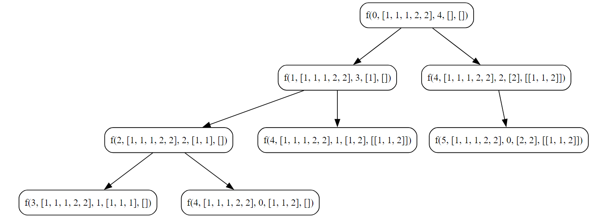

## Combination Sum II

**Given a collection of candidate numbers ( `candidates`) and a target number (`target`),  find all unique combinations in `candidates` where the candidate numbers sum to `target`. **
- Each number in `candidates` may only be used **once** in the combination.
- **Note**: The solution set must not contain duplicate combinations.

**Example:**
```
Input: candidates = [10,1,2,7,6,1,5], target = 8
Output:
[
[1,1,6],
[1,2,5],
[1,7],
[2,6]
]
```

### Objective
Generate all unique combinations of elements from a sorted array that sum up to a given target.

**Key Steps**

1. **Initialization**
    
    - Initialize a sorted array, `arr`, with elements `[1, 1, 1, 2, 2]`.
    - Sort the array using the `DoQuickSort` function.
    - Initialize an empty 2D slice, `ans`, to store unique combinations.
    - Initialize an empty slice, `ds`, to represent the current combination being considered.
    - Set the target sum, `target`, to `4`.
2. **Base Case**
    
    - If the target sum becomes `0`, append the current combination `ds` to the result `ans`.
    - Ensure unique combinations by creating a copy of `ds` before appending.
3. **Recursive Exploration**
    
    - Iterate through the sorted array starting from the current index `ind`.
    - Skip duplicates to avoid redundant combinations.
    - If the current element is greater than the remaining target, break the loop.
    - Add the current element to the combination `ds`.
    - Recursively call the function with the updated index, array, reduced target, updated combination, and result slice.
    - Remove the last element from the combination `ds` to backtrack and explore other possibilities.
4. **Result**
    
    - Print the original sorted array `arr`.
    - Print the resulting 2D slice `ans` containing all unique combinations.

### Code

**Go**
```go
package subseq

import (
	"fmt"
)

func CombinationSum2() {
	fmt.Println("Tutorial for Combination Sum 2")
	var arr = []int{1, 1, 1, 2, 2}
	var length int = len(arr)

	// Required Sorted Array
	DoQuickSort(&arr, 0, length-1)

	var ans [][]int
	var ds []int
	var target int = 4
	DoCombinationSum2(0, &arr, target, ds, &ans)

	fmt.Println("Input : ", arr)
	fmt.Println("Output : ", ans)
}

func DoCombinationSum2(ind int, arr *[]int, target int, ds []int, ans *[][]int) {
	if target == 0 {
		// (*ans) = append((*ans), ds)
		dsCopy := make([]int, len(ds))
		copy(dsCopy, ds)
		(*ans) = append((*ans), ds)
		return
	}

	for i := ind; i < len((*arr)); i++ {
		if i > ind && (*arr)[i] == (*arr)[i-1] {
			continue
		}

		if (*arr)[i] > target {
			break
		}

		ds = append(ds, (*arr)[i])
		DoCombinationSum2(i+1, arr, target-(*arr)[i], ds, ans)
		ds = ds[:len(ds)-1]

	}

}

```

**Output**
```
Tutorial for Combination Sum 2
Input :  [1 1 1 2 2]
Output :  [[1 1 2] [2 2]]
```

**Python**
```python
def do_combination_sum2(ind, arr, target, ds, ans):
    if target == 0:
        ans.append(ds.copy())
        return

    for i in range(ind,len(arr)):
        if i > ind and arr[i] == arr[i-1]:
            continue

        if arr[i] > target:
            break

        ds.append(arr[i])

        do_combinational_sum2(i+1, arr, target-arr[i], ds, ans)
        
        ds.pop()

arr = [1,1,1,2,2]
ds = []
target = 4
ans = []

do_combination_sum2(0, arr, target, ds, ans)

print(ans)
```

**Output**
```
[[1, 1, 2], [2, 2]]
```
### Algorithmic Complexity Analysis

#### Time Complexity
The time complexity of the provided code is influenced by the recursive exploration of combinations. Let's analyze it:

- The function `DoCombinationalSum2` is called for each element in the array, and for each element, it makes recursive calls.
- The recursion is bounded by the number of elements in the array and the possibilities of including or excluding each element.
- In the worst case, the number of recursive calls will be exponential, particularly when there are duplicate elements.
- Sorting the array using quicksort contributes a time complexity of O(n log n), where n is the length of the array.

Therefore, the overall time complexity is dominated by the exponential recursive calls, and it can be expressed as \(O(2^n \cdot n \log n)\), where \(n\) is the length of the input array.

#### Space Complexity:
The space complexity is determined by the space used in the function call stack and the auxiliary space for the combinations stored in the `ans` slice.

- The depth of the recursion is at most equal to the length of the input array \(n\).
- In each recursive call, a new frame is added to the call stack, consuming space proportional to \(n\).
- The `ans` slice stores the combinations, and in the worst case, it can contain \(2^n\) combinations.

Therefore, the space complexity can be expressed as \(O(n) + O(2^n)\), where \(n\) is the length of the input array.

In summary
- **Time Complexity:** \(O(2^n \cdot n \log n)\)
- **Space Complexity:** \(O(n) + O(2^n)\)

### Recursion Tree

