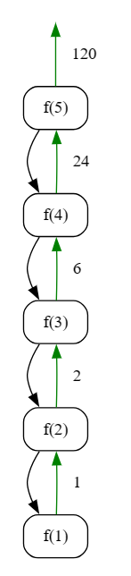

## Factorial

### Objective

Implement an algorithm to calculate the factorial of a given integer \( n \). The factorial of a non-negative integer \( n \) is the product of all positive integers less than or equal to \( n \). It is denoted by \( n! \).

**Key Steps**

1. **Initialization**
   - Set the value of \( n \) for which the factorial is to be calculated (e.g., \( n = 5 \)).

2. **Factorial Calculation Algorithm**
   - Call the `getFactorial` function, passing the value of \( n \).
   - The objective is to calculate and return the factorial of \( n \).

3. **Base Case**
   - In the `getFactorial` function, check if \( n \) is equal to 1. If true, return 1 (base case of factorial).

4. **Recursive Multiplication**
   - If \( n \) is greater than 1, recursively call the `getFactorial` function for \( n-1 \) and multiply the result by \( n \).

5. **Return Result**
   - Return the result of the multiplication as the factorial of \( n \).

**Note**
- The algorithm assumes a non-negative integer \( n \) for which the factorial is calculated.


### Code

**Go**
```go
package subseq

import "fmt"

func GetFactorial() {
	fmt.Println("Tutorial for Factorial")
	// 1 * 2 * 3 * 4 * 5 = 120
	var n int = 5
	result := getFactorial(n)
	fmt.Println(result)

}

func getFactorial(n int) int {
	if n == 1 {
		return 1
	}

	return n * getFactorial(n-1)
}
```

**Output**
```
Tutorial for Factorial
120
```

**Python**
```python
def get_factorial(n):
    if n == 1:
        return n

    return n * get_factorial(n-1)


n = 5
result = get_factorial(n)
print(result)
```

**Output**
```
120
```
### Algorithmic Complexity Analysis
#### Time Complexity:
The time complexity of the provided code can be analyzed as follows:

- **Recursive Calls:**
  - The `getFactorial` function makes a series of recursive calls until reaching the base case (\(n == 1\)).
  - The number of recursive calls is proportional to the value of \(n\).
  
Therefore, the overall time complexity is \(O(n)\), where \(n\) is the input value for which the factorial is calculated.

#### Space Complexity:
The space complexity is influenced by the depth of the recursive call stack:

- **Recursive Call Stack:**
  - The depth of the recursion is at most \(n\), corresponding to the value of \(n\) in the factorial calculation.
  - Each recursive call consumes a constant amount of space on the call stack.

Therefore, the overall space complexity is \(O(n)\), where \(n\) is the input value for which the factorial is calculated.

In summary:
- **Time Complexity:** \(O(n)\)
- **Space Complexity:** \(O(n)\)
### Recursion Tree
