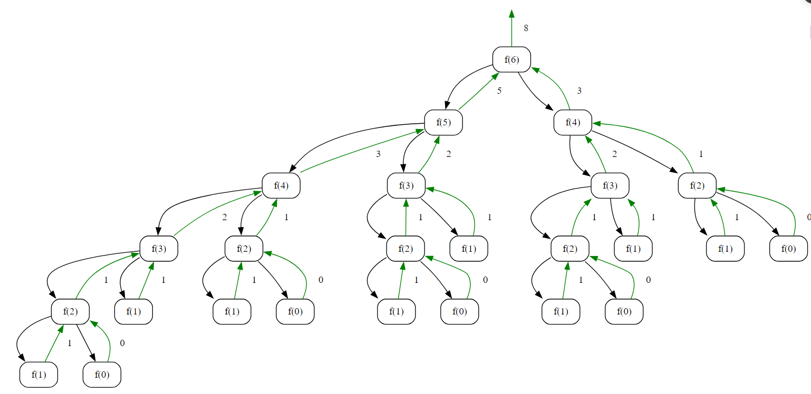

## Fibonacci

### Objective
Implement an algorithm to calculate the �nth term in the Fibonacci series using multiple recursive calls.

### Objective:
Implement an algorithm to calculate the \(n\)th term in the Fibonacci series using multiple recursive calls.

**Key Steps**

1. **Initialization**
   - Prompt the user to input the value of \(n\) for which the Fibonacci series term is to be calculated.

2. **Fibonacci Calculation Algorithm**
   - Call the `getFibonacci` function, passing the user-input value of \(n\).
   - The objective is to calculate and return the \(n\)th term in the Fibonacci series.

3. **Base Case**
   - In the `getFibonacci` function, check if \(n\) is less than or equal to 1. If true, return \(n\) (base case of Fibonacci series).

4. **Recursive Calls**
   - If \(n\) is greater than 1, recursively call the `getFibonacci` function for \(n-1\) and \(n-2\) to get the Fibonacci values for the two preceding terms.
   - Let \(a\) be the result of the recursive call for \(n-1\).
   - Let \(b\) be the result of the recursive call for \(n-2\).

5. **Calculate Fibonacci Term**
   - Return the sum of \(a\) and \(b\) as the \(n\)th term in the Fibonacci series.
**Note**
- The algorithm relies on multiple recursive calls to calculate Fibonacci series terms, which may result in exponential time complexity.
### Code
**Go**
```go
package subseq

import (
	"bufio"
	"fmt"
	"os"
	"strconv"
	"strings"
)

func GetFibonacci() {
	fmt.Println("Get Fibonacci on Mulitple Recurssion Calls")
	fmt.Print("Enter nth series for Fibonacci : ")
	reader := bufio.NewReader(os.Stdin)
	input, _ := reader.ReadString('\n')
	input = strings.TrimSpace(input)

	n, _ := strconv.Atoi(input)

	fibonacci := getFibonacci(n)

	fmt.Println(fibonacci)

}

func getFibonacci(n int) int {
	if n <= 1 {
		return n
	}

	a := getFibonacci(n - 1)
	b := getFibonacci(n - 2)
	return a + b
}
```

**Output**
```
Get Fibonacci on Mulitple Recurssion Calls
Enter nth series for Fibonacci : 6
8
```

**Python**
```python
def get_fibonacci(n):
    if n <= 1:
        return n

    return get_fibonacci(n - 1) + get_fibonacci(n - 2)


n = 6
print(get_fibonacci(n))
```

```
8
```

### Algorithmic Complexity Analysis
#### Time Complexity
The time complexity of the provided code can be analyzed as follows:

- **Recursive Calls**
  - The `getFibonacci` function makes two recursive calls for each value of \(n\), one for \(n-1\) and one for \(n-2\).
  - The number of recursive calls follows the Fibonacci sequence, resulting in exponential growth.
  - For a given \(n\), the number of recursive calls is approximately \(2^n\).

Therefore, the overall time complexity is exponential, \(O(2^n)\), where \(n\) is the input value for the Fibonacci series.

#### Space Complexity
The space complexity is influenced by the depth of the recursive call stack:

- **Recursive Call Stack**
  - The depth of the recursion is at most \(n\), corresponding to the value of \(n\) in the Fibonacci series.
  - Each recursive call consumes a constant amount of space on the call stack.

Therefore, the overall space complexity is linear, \(O(n)\), where \(n\) is the input value for the Fibonacci series.

In summary:
- **Time Complexity:** \(O(2^n)\)
- **Space Complexity:** \(O(n)\)

### Recursion Tree
