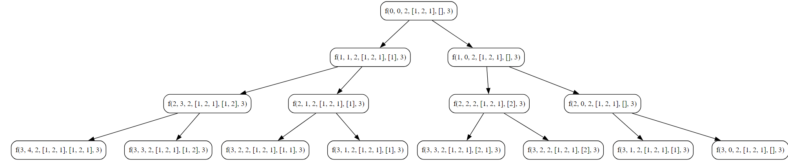

## Get all the subsequence's

### Objective
Implement and understand an algorithm to find all subsequence's of a given array whose elements sum to a specified value.

**Key Steps**

1. **Initialization**
    - Initialize an array, `arr`, with elements `[1, 2, 1]`.
    - Set the target sum, `sum`, to `2`.
    - Initialize an empty array, `blank_arr`, to store the subsequences.
2. **Subsequence Sum Algorithm**
    
    - Call the `getAllSubsequences` function, passing the array, initial index (`0`), current sum (`0`), target sum, empty array, and length of the array.
    - The `getAllSubsequences` function is responsible for generating all possible subsequences and checking if their sum equals the target sum.
3. **Generate Subsequences**
    - In the `getAllSubsequences` function, if the current index `i` reaches the length of the array, check if the current sum `s` equals the target sum.
    - If the sum is equal, print the current subsequence stored in `empty_arr`.
4. **Pick Element Case**
    - Include the current element in the subsequence by appending it to `empty_arr`.
    - Update the current sum `s` by adding the current element.
    - Recursively call the `getAllSubsequences` function with the next index (`i+1`).
5. **Backtrack**
    - Remove the last element from `empty_arr` to backtrack and explore other possibilities.
    - Update the current sum `s` by subtracting the removed element.
6. **Not Pick Element Case**
    - Recursively call the `getAllSubsequences` function without including the current element in the subsequence.
### Code
**Go**
```go
package subseq

import (
	"fmt"
)

func SubSeqSum() {
	fmt.Println("Tutorial for sub sequences sum")

	var arr = []int{1, 2, 1}
	var n = len(arr)
	var sum = 2
	var blank_arr []int

	// Get all the sub sequences
	getAllSubsequences(0, 0, sum, arr, &blank_arr, n)
}

func getAllSubsequences(i int, s int, sum int , arr []int, empty_arr *[]int, n int ) {
	if i == n {
		if s == sum {
			fmt.Println(*empty_arr)
		}
		return
	}

	*empty_arr = append(*empty_arr, arr[i])

	s += arr[i]

	// pick element case
	getAllSubsequences(i+1, s, sum,  arr, empty_arr, n)

	*empty_arr = (*empty_arr)[:len(*empty_arr)-1]
	s -= arr[i]

	// not pick element case
	getAllSubsequences(i+1, s, sum, arr, empty_arr, n)

}
```
**Output**
```
Tutorial for sub sequences sum
[1 1]
[2]
```

**Python**
```python
def get_all_subsequences(i, s, sum, arr, empty_arr, n):
    if i == n:
        if s == sum:
            print(empty_arr)

        return

    empty_arr.append(arr[i])

    s += arr[i]

    # pick element case
    get_all_subsequences(i+1, s, sum, arr, empty_arr, n)

    empty_arr.pop()
    s -= arr[i]

    # not pick element case
    get_all_subsequences(i+1, s, sum, arr, empty_arr, n)


arr = [1, 2, 1]
n = len(arr)
sum = 2
blank_arr = []

get_all_subsequences(0, 0, sum, arr, blank_arr, n)
```

**Output**
```
[1 1]
[2]
```
### Algorithmic Complexity Analysis
### Time Complexity:
The time complexity of the provided code can be analyzed as follows:

- **Generating Subsequences:**
  - The `getAllSubsequences` function is called for each element in the array, and for each element, two recursive calls are made (pick and not pick).
  - The number of recursive calls is \(2^n\), where \(n\) is the length of the array. This is because, for each element, there are two choices (include or exclude).
  - Each recursive call involves constant-time operations.

Therefore, the overall time complexity is exponential, \(O(2^n)\), where \(n\) is the length of the array.

### Space Complexity:
The space complexity is influenced by the recursive call stack and the space used for the temporary array (`empty_arr`):

- **Recursive Call Stack:**
  - The depth of the recursion is at most \(n\) (the length of the array). Each recursive call consumes a constant amount of space on the call stack.
  - Therefore, the space used by the call stack is \(O(n)\).

- **Temporary Array:**
  - The size of the temporary array (`empty_arr`) can be at most \(n\) elements (when all elements are included in a subsequence).
  - Therefore, the space used by the temporary array is \(O(n)\).

Combining both contributions, the overall space complexity is \(O(n)\).

In summary:
- **Time Complexity:** \(O(2^n)\)
- **Space Complexity:** \(O(n)\)

### Recursion Tree

