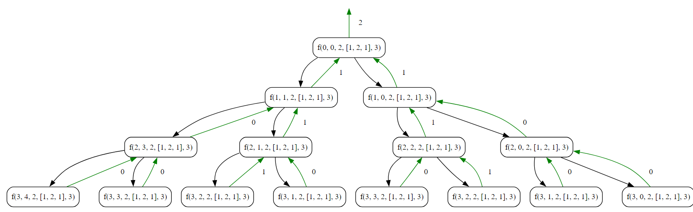

## Get count of Subsequence's

### Objective

Implement an algorithm to find and return the count of subsequence's of a given array whose elements sum to a specified value.

### Key Steps:

1. **Initialization**
    
    - Initialize an array, `arr`, with elements `[1, 2, 1]`.
    - Set the target sum, `sum`, to `2`.
2. **Count of Subsequence's Sum Algorithm**
    
    - Call the `getSubsequenceCount` function, passing the array, initial index (`0`), target array length (`n`), current sum (`0`), and target sum.
    - The objective is to find and return the count of valid subsequence's whose elements sum to the target sum.
3. **Recursive Counting**
    
    - In the `getSubsequenceCount` function, if the current index `i` reaches the length of the array, check if the current sum `s` equals the target sum.
    - If the sum is equal, return `1` to indicate that a valid subsequence has been found.
4. **Take Element Case:**
    
    - Include the current element in the subsequence by adding it to the current sum `s`.
    - Recursively call the `getSubsequenceCount` function with the next index (`i+1`) and updated sum.
    - The result (`l`) represents the count of subsequence's that include the current element.
5. **Backtrack:**
    
    - Remove the last element from the current sum `s` to backtrack and explore other possibilities.
6. **Not Take Element Case:**
    
    - Recursively call the `getSubsequenceCount` function without including the current element in the subsequence.
    - The result (`r`) represents the count of subsequences that do not include the current element.
7. **Return Total Count:**
    
    - Return the sum of counts obtained from both taking and not taking the current element.

### Code
**Go**
```go
package subseq

import (
	"fmt"
)

func SubSeqSum() {
	fmt.Println("Tutorial to get count of sub sequences sum")

	var arr = []int{1, 2, 1}
	var n = len(arr)
	var sum = 2
	
	// Get the count of subsequences
	fmt.Println(getSubsequenceCount(0, 0, sum, arr, n))
}

// Return the count of Subsequence
/*
base case
return 1 -> condition satisfied
return 0 -> condition not satisfied
l = f()
r = f()
return l + r
*/
func getSubsequenceCount(i int, s int, sum int, arr []int, n int) int {
	if i == n {
		// if condition satisfied
		if s == sum {
			return 1
		} else {
			// Condition not satisified
			return 0
		}
	}

	s += arr[i]

	// take
	l := getSubsequenceCount(i+1, s, sum, arr, n)

	s -= arr[i]

	// not take
	r := getSubsequenceCount(i+1, s, sum, arr, n)

	return l + r
}
```

**Output**
```
Tutorial to get count of sub sequences sum
2
```

**Python**
```python
def get_subsequence_count(i, s, sum, arr, n):
    if i == n:
        if s == sum:
            return 1
        return 0

    s += arr[i]

    # take
    l = get_subsequence_count(i+1, s, sum, arr, n)

    s -= arr[i]

    # not take
    r = get_subsequence_count(i+1, s, sum, arr, n)

    return l + r


arr = [1, 2, 1]
n = len(arr)
sum = 2

print(get_subsequence_count(0, 0, sum, arr, n))
```

**Output**
```
2
```
### Algorithmic Complexity Analysis
#### Time Complexity
The time complexity of the provided code can be analyzed as follows:

- **Counting Subsequences**
  - The `getSubsequenceCount` function is called for each element in the array, and for each element, two recursive calls are made (take and not take).
  - The number of recursive calls is \(2^n\), where \(n\) is the length of the array. This is because, for each element, there are two choices (include or exclude).
  - Each recursive call involves constant-time operations.

Therefore, the overall time complexity is exponential, \(O(2^n)\), where \(n\) is the length of the array.

#### Space Complexity
The space complexity is influenced by the recursive call stack:

- **Recursive Call Stack**
  - The depth of the recursion is at most \(n\) (the length of the array). Each recursive call consumes a constant amount of space on the call stack.
  - Therefore, the space used by the call stack is \(O(n)\).

In summary:
- **Time Complexity:** \(O(2^n)\)
- **Space Complexity:** \(O(n)\)
### Recursion Tree

