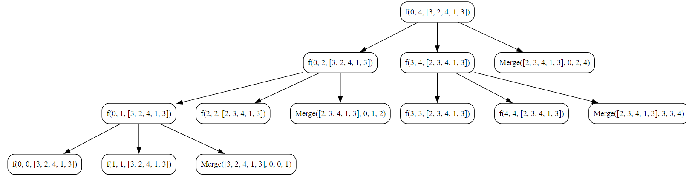

## Merge Sort Algorithm

Merge Sort is a comparison-based sorting algorithm that follows the divide-and-conquer paradigm. It was developed by John von Neumann in 1945. The key idea behind Merge Sort is to divide the array into two halves, recursively sort each half, and then merge the sorted halves to produce a sorted array.

**Key Steps**

1. **Divide**
    
    - Divide the unsorted array into two halves. This step is repeated recursively until each subarray has only one element.
2. **Conquer*
    
    - Recursively sort each subarray. This is done by applying the Merge Sort algorithm to each half.
3. **Merge**
    
    - Merge the sorted subarrays to produce a single sorted array.
    - The merging process involves comparing elements from the two sorted halves and merging them in the correct order.

### Objective
Implement and understand the Merge Sort algorithm to efficiently sort an array in non-decreasing order.

**Key Steps**

1. **Initialization**
    
    - Initialize an array, `arr`, with elements `[3, 2, 4, 1, 3]`.
    - Print the array before sorting to show the initial order.
2. **Merge Sort**
    
    - Call the `MergeSort` function, passing the array, starting index (`0`), and ending index (`length-1`).
    - The `MergeSort` function recursively divides the array into halves and sorts each half.
3. **Divide**
    
    - In the `MergeSort` function, calculate the middle index `mid` to divide the array into two halves.
    - Recursively apply the `MergeSort` function to the first half (from `low` to `mid`).
    - Recursively apply the `MergeSort` function to the second half (from `mid+1` to `high`).
4. **Conquer**
    
    - Merge the two sorted halves using the `Merge` function.
    - The `Merge` function compares elements from the two halves and merges them in the correct order.
5. **Merge**
    
    - Create a temporary array, `temp`, to store the merged result.
    - Compare elements from the left and right halves, and append the smaller element to the `temp` array.
    - Continue this process until one of the halves is exhausted.
    - Append any remaining elements from both halves to the `temp` array.
    - Copy the elements from the `temp` array back to the original array, updating the values in the specified range.
6. **Result**
    
    - Print the array after sorting to show the final sorted order.


### Code
**Go**
```go
package subseq

import "fmt"

func MergSortAlgorithm() {
	fmt.Println("Merge Sort Algorithm Tutorial")
	var arr = []int{3, 2, 4, 1, 3}
	var length int = len(arr) - 1

	fmt.Println("Before Sorting : ", arr)
	
	// Calling Merge Sort Function
	MergeSort(0, length, &arr)


	fmt.Println("After Sorting : ", arr)

}

func MergeSort( low int, high int, arr *[]int) {

	if low >= high {
		return
	}

	var mid int = (low + high) / 2

	// Merge Sort First Half of array
	MergeSort(low, mid, arr)

	// Merge Sort second half of array
	MergeSort(mid+1, high, arr)

	// Merge the array
	Merge(&arr, low, mid, high)
}

func Merge(arr **[]int, low int, mid int, high int) {
	var temp []int
	left := low
	right := mid + 1

	for left <= mid && right <= high {
		if (**arr)[left] <= (**arr)[right] {
			temp = append(temp, (**arr)[left])
			left++
		} else {
			temp = append(temp, (**arr)[right])
			right++
		}
	}

	for left <= mid {
		temp = append(temp, (**arr)[left])
		left++
	}

	for right <= high {
		temp = append(temp, (**arr)[right])
		right++
	}

	for i := low; i <= high; i++ {
		(**arr)[i] = temp[i-low]
	}

}
```

**Output**
```
Merge Sort Algorithm Tutorial                               
Before Sorting :  [3 2 4 1 3]
After Sorting :  [1 2 3 3 4]
```

**Python**
```python
def merge_sort(low, high, arr):
    if low >= high:
        return

    mid = (low + high) // 2

    # Merge Sort First Half of array
    merge_sort(low, mid, arr)

    # Merge Sort Second Half of array
    merge_sort(mid+1, high, arr)

    # Merge the array
    Merge(arr, low, mid, high)


def Merge(arr, low, mid, high):
    temp = []
    left = low
    right = mid + 1

    while left <= mid and right <= high:
        if arr[left] <= arr[right]:
            temp.append(arr[left])
            left += 1

        else:
            temp.append(arr[right])
            right += 1

    while left <= mid:
        temp.append(arr[left])
        left += 1

    while right <= high:
        temp.append(arr[right])
        right += 1

    for i in range(low, high+1):
        arr[i] = temp[i-low]


arr = [3, 2, 4, 1, 3]
length = len(arr) - 1
merge_sort(0, length, arr)
print(arr)
```

**Output**
```
[1, 2, 3, 3, 4]
```

### Algorithmic Complexity Analysis

### Time Complexity:
The time complexity of the provided Merge Sort code can be analyzed as follows:

- **Divide (Splitting):**
  - The `MergeSort` function recursively divides the array into halves until each subarray has one element.
  - The division process takes \(O(\log n)\) time, where \(n\) is the number of elements in the array.

- **Conquer (Merging):**
  - The `Merge` function merges two sorted halves into a single sorted array.
  - The merging process takes \(O(n)\) time, where \(n\) is the number of elements in the array.

Considering both divide and conquer steps, the overall time complexity of Merge Sort is \(O(n \log n)\), making it efficient for large datasets.

### Space Complexity:
The space complexity of the provided Merge Sort code is influenced by the recursive call stack and the auxiliary space used for merging:

- The depth of the recursion is at most \(\log n\), where \(n\) is the number of elements in the array. Each recursive call consumes a constant amount of space on the call stack.
- The `Merge` function uses additional space for the temporary array (`temp`) during the merging process. The size of the temporary array is \(O(n)\).

Therefore, the overall space complexity can be expressed as \(O(\log n) + O(n)\), where \(n\) is the number of elements in the array.

In summary:
- **Time Complexity:** \(O(n \log n)\)
- **Space Complexity:** \(O(\log n) + O(n)\)

### Recursion Tree
