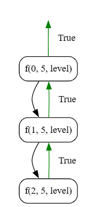

## Palindrome

### Objective

Implement an algorithm to check whether a given string is a palindrome or not. A palindrome is a word, phrase, number, or other sequence of characters that reads the same forward and backward (ignoring spaces, punctuation, and capitalization).

**Key Steps**

1. **User Input:**
    
    - Prompt the user to enter a string.
2. **Palindrome Check Algorithm**
    
    - Call the `isPalindrome` function, passing the string as an array of characters.
    - The objective is to check whether the input string is a palindrome.
3. **Base Case**
    
    - In the `isPalindrome` function, check if the current index `i` is greater than or equal to half the length of the string. If true, return `true` (indicating a palindrome).
4. **Recursive Comparison**
    
    - Compare the character at index `i` with the character at the corresponding position from the end (`n-i-1`).
    - If the characters are not equal, print the current state of the string and return `false`.
5. **Recursive Call**
    
    - Recursively call the `isPalindrome` function with the next index (`i+1`).


### Code
**Go**
```go
package subseq

import (
	"bufio"
	"fmt"
	"os"
	"strings"
)

func IsPalindrome() {
	fmt.Println("Tutorial to Check Palindrom")
	fmt.Println("Please enter your string : ")
	reader := bufio.NewReader(os.Stdin)
	input, _ := reader.ReadString('\n')
	input = strings.TrimSpace(input)

	strArr := strings.Split(input, "")

	var isPalindrome bool = isPalindrome(0, len(strArr), &strArr)

	fmt.Println("Before Palindrome Operation : ", strArr)
	fmt.Println("isPalindrome : ", isPalindrome)
	fmt.Println("After Palindrome Operation : ", strArr)

}

func isPalindrome(i int, n int, arr *[]string) bool {

	if i >= n/2 {
		return true
	}

	if (*arr)[i] != (*arr)[n-i-1] {
		fmt.Println((*arr))
		return false
	}

	return isPalindrome(i+1, n, arr)

}
```

**Output**
```
Tutorial to Check Palindrom
Please enter your string :
madam
Before Palindrome Operation :  [m a d a m]
isPalindrome :  true
After Palindrome Operation :  [m a d a m]
```

**Python**
```python
def isPalindrome(i, n, arr):
    if i >= n//2:
        return True

    if arr[i] != arr[n-i-1]:
        print(arr)
        return False

    return isPalindrome(i+1, n, arr)


arr = "level"
check_palindrome = isPalindrome(0, len(arr), arr)
print(check_palindrome)
```

**Output**
```
True
```
### Algorithmic Complexity Analysis
#### Time Complexity:
The time complexity of the provided code can be analyzed as follows:

- **String Comparison:**
  - The `isPalindrome` function compares characters from the beginning and end of the string toward the middle.
  - The number of comparisons is proportional to half the length of the string.
  - The time complexity for the comparison step is \(O(n/2)\), where \(n\) is the length of the string.

Therefore, the overall time complexity is \(O(n)\), where \(n\) is the length of the string.

#### Space Complexity:
The space complexity is influenced by the depth of the recursive call stack:

- **Recursive Call Stack:**
  - The depth of the recursion is at most \(n/2\) (half the length of the string). Each recursive call consumes a constant amount of space on the call stack.

- **Additional Space:**
  - The algorithm uses a constant amount of additional space to store temporary variables.

Therefore, the overall space complexity is \(O(n)\), where \(n\) is the length of the string.

In summary:
- **Time Complexity:** \(O(n)\)
- **Space Complexity:** \(O(n)\)
### Recursion Tree
