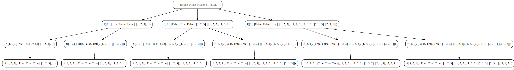

## Permutations Approach - I

**Permutations**

A permutation is an arrangement of objects in a specific order. For a set of distinct elements, a permutation is a specific ordering of those elements.

**Example**

Consider the set {1, 2, 3}. The permutations of this set are:

1. [1, 2, 3]
2. [1, 3, 2]
3. [2, 1, 3]
4. [2, 3, 1]
5. [3, 1, 2]
6. [3, 2, 1]

**Notation**
- n! is read as "n factorial."

**Formula**
The number of permutations of \(n\) distinct elements is given by the factorial of \(n\), denoted as \(n!\):

n! = n x (n - 1) x (n - 2) x ... 3 x 2 x 1

**Example**
For a set of three distinct elements {A, B, C}, the number of permutations is:

3! = 3 x 2 x 1 = 6

---


Given an array `nums` of distinct integers, return all the possible permutations. You can return the answer in any order.

> **Solution using Extra Space Complexity**

**Example**
```
Input: nums = [1,2,3]
Output: [[1,2,3],[1,3,2],[2,1,3],[2,3,1],[3,1,2],[3,2,1]]
```

### Objective
Implement an algorithm to generate all permutations of a given array of integers using a recursive approach.

**Key Steps**

1. **Initialization**
   - Create an array `arr` with integers for which permutations are to be generated (e.g., `{1, 2, 3}`).
   - Initialize an empty array `ans` to store the permutations.
   - Create a boolean array `freq` of the same length as `arr` to keep track of whether an element has been used in the current permutation.
   - Initialize an empty array `ds` to represent the current permutation.

2. **Permutation Algorithm**
   - Call the `getPermutation` function with pointers to `ds`, `freq`, `arr`, and `ans`.
   - The objective is to generate and store all permutations in the `ans` array.

3. **Base Case**
   - In the `getPermutation` function, check if the length of the current permutation (`ds`) is equal to the length of the original array (`arr`).
   - If true, create a copy of the current permutation and append it to the `ans` array.

4. **Recursive Permutation**
   - Iterate over each element in the original array (`arr`) using a loop.
   - For each element, check if it has not been used in the current permutation (based on `freq`).
   - If not used, mark it as used, append it to the current permutation (`ds`), and make a recursive call to `getPermutation`.

5. **Backtracking**
   - After the recursive call, remove the last element from the current permutation (`ds`) and mark the corresponding element in `freq` as not used.
   - This step is crucial for backtracking and exploring other possibilities.

6. **Result**
   - The `ans` array will contain all permutations of the original array.
### Code
**Go**
```go
package subseq

import "fmt"

func PermutationApproach1() {
	fmt.Println("Tutorial Permutation Approach 1")

	var arr = []int{1, 2, 3}
	var ans [][]int
	var freq []bool = make([]bool, len(arr))
	var ds []int

	getPermutation(&ds, &freq, &arr, &ans)

	fmt.Println("Input Array : ", arr)
	fmt.Println("Permutation : ", ans)

}

func getPermutation(ds *[]int, freq *[]bool, arr *[]int, ans *[][]int) {
	// basecase
	if len(*ds) == len(*arr) {
		dsCopy := make([]int, len(*ds))
		copy(dsCopy, *ds)
		(*ans) = append((*ans), dsCopy)
		return
	}

	for ind, value := range *arr {
		if !(*freq)[ind] {
			(*freq)[ind] = true
			(*ds) = append((*ds), value)

			getPermutation(ds, freq, arr, ans)

			// taking out from ds and freq
			(*ds) = (*ds)[:len((*ds))-1]
			(*freq)[ind] = false

		}
	}

}
```

**Output**
```go
Tutorial Permutation Approach 1
Input Array :  [1 2 3]
Permutation :  [[1 2 3] [1 3 2] [2 1 3] [2 3 1] [3 1 2] [3 2 1]]
```

**Python**
```python
def get_permutation(ds, freq, arr, ans):
    if len(ds) == len(arr):
        ans.append(ds.copy())
        return

    for ind, value in enumerate(arr):
        if not freq[ind]:
            freq[ind] = True
            ds.append(value)

            get_permutation(ds, freq, arr, ans)

            # taking out from ds and freq
            ds.pop()
            freq[ind] = False

arr = [1, 2, 3]
ans = []
freq = [False] * len(arr)
ds = []

get_permutation(ds, freq, arr, ans)
print(ans)
```

**Output**
```python
[[1, 2, 3], [1, 3, 2], [2, 1, 3], [2, 3, 1], [3, 1, 2], [3, 2, 1]]
```
### Algorithmic Complexity Analysis
#### Time Complexity
Let \(n\) be the length of the array `arr`.

The time complexity is determined by the number of recursive calls and the work done in each call. In each recursive call, we iterate through all elements of `arr` to generate permutations. The number of recursive calls is \(n!\) (factorial of \(n\)) since we generate all possible permutations.

Therefore, the time complexity is \(O(n! \cdot n)\).

#### Space Complexity
The space complexity is influenced by the recursive call stack and the storage required for the `ans`, `ds`, and `freq` arrays.

1. **Recursive Call Stack**
   - The maximum depth of the recursive call stack is \(n\), corresponding to the length of the array.
   - Each recursive call consumes a constant amount of space.

2. **Arrays**
   - The space required for the `ans` array is proportional to the total number of permutations, which is \(n!\).
   - The space required for the `ds` and `freq` arrays is proportional to the length of the array, i.e., \(n\).

Therefore, the overall space complexity is \(O(n! + n)\).

In summary:
- **Time Complexity:** \(O(n! \cdot n)\)
- **Space Complexity:** \(O(n! + n)\)

### Recursion Tree

