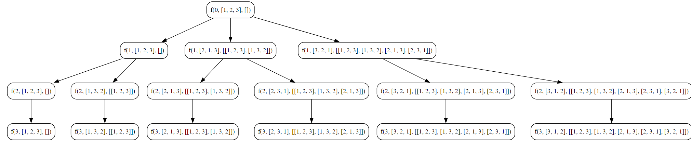

## Permutations Approach - II

> **Solution using Swapping**

### Objective
Implement an algorithm to generate all permutations of a given array of integers using a different approach involving swapping elements.

**Key Steps**

1. **Initialization**
   - Create an array `arr` with integers for which permutations are to be generated (e.g., `{1, 2, 3}`).
   - Initialize an empty array `ans` to store the permutations.

2. **Permutation Algorithm**
   - Call the `getPermutation2` function with pointers to `arr` and `ans`.
   - The objective is to generate and store all permutations in the `ans` array.

3. **Base Case**
   - In the `getPermutation2` function, check if the current index (`ind`) is equal to the length of the array (`arr`).
   - If true, create a copy of the current array and append it to the `ans` array.

4. **Swapping Elements**
   - Iterate over elements from the current index (`ind`) to the end of the array.
   - Swap the current element with the element at the current index.
   - Make a recursive call to `getPermutation2` with the updated array.

5. **Backtracking**
   - After the recursive call, swap the elements back to their original positions.
   - This step is crucial for backtracking and exploring other possibilities.

6. **Result**
   - The `ans` array will contain all permutations of the original array.

### Code

**Go**
```go
package subseq

import (
	"fmt"
)

func PermutationApproach2() {
	fmt.Println("Tutorial Permutation Approach 2")

	var arr = []int{1, 2, 3}
	var ans [][]int

	getPermutation2(0, &arr, &ans)

	fmt.Println("Input Array : ", arr)
	fmt.Println("Permutation : ", ans)

}

func getPermutation2(ind int, arr *[]int, ans *[][]int) {

	if ind == len(*arr) {
		dsCopy := make([]int, len((*arr)))
		copy(dsCopy, (*arr))

		(*ans) = append((*ans), dsCopy)
		return
	}

	for i := ind; i < len((*arr)); i++ {
		(*arr)[i], (*arr)[ind] = (*arr)[ind], (*arr)[i]

		getPermutation2(ind+1, arr, ans)

		// re swapping
		(*arr)[i], (*arr)[ind] = (*arr)[ind], (*arr)[i]

	}

}
```

**Output**
```go
Tutorial Permutation Approach 2
Input Array :  [1 2 3]
Permutation :  [[1 2 3] [1 3 2] [2 1 3] [2 3 1] [3 2 1] [3 1 2]]
```

**Python**
```python
def get_permutation2(ind, arr, ans):
    if ind == len(arr):
        ans.append(arr.copy())
        return

    for i in range(ind, len(arr)):
        arr[i], arr[ind] = arr[ind], arr[i]

        get_permutation2(ind+1, arr, ans)

        # re swapping
        arr[i], arr[ind] = arr[ind], arr[i]


arr = [1, 2, 3]
ans = []

get_permutation2(0, arr, ans)

print(ans)
```

**Output**
```python
[[1, 2, 3], [1, 3, 2], [2, 1, 3], [2, 3, 1], [3, 2, 1], [3, 1, 2]]
```
### Algorithmic Complexity Analysis
#### Time Complexity
Let \(n\) be the length of the array `arr`.

The time complexity is determined by the number of recursive calls and the work done in each call. In each recursive call, we iterate through elements from the current index to the end of the array. The number of recursive calls is \(n!\) (factorial of \(n\)) since we generate all possible permutations.

Therefore, the time complexity is \(O(n!)\).

#### Space Complexity
The space complexity is influenced by the recursive call stack and the storage required for the `ans` array.

1. **Recursive Call Stack**
   - The maximum depth of the recursive call stack is \(n\), corresponding to the length of the array.
   - Each recursive call consumes a constant amount of space.

2. **Arrays**
   - The space required for the `ans` array is proportional to the total number of permutations, which is \(n!\).

Therefore, the overall space complexity is \(O(n!)\).

In summary:
- **Time Complexity:** \(O(n!)\)
- **Space Complexity:** \(O(n!)\)
### Recursion Tree

