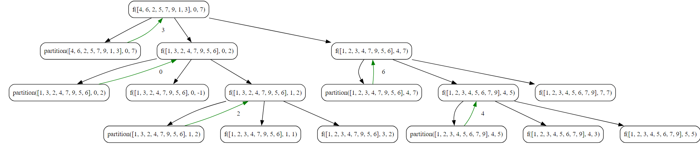

## Quick Sort Algorithm

Quick Sort is a widely used comparison-based sorting algorithm that follows the divide-and-conquer paradigm. It was developed by Tony Hoare in 1960. The key idea behind Quick Sort is to partition the array into two subarrays and then recursively sort each subarray.

### Objective

Implement and understand the Quick Sort algorithm to efficiently sort an array in non-decreasing order.

**Key Steps**

1. **Initialization**
    
    - Initialize an array, `arr`, with elements `[4, 6, 2, 5, 7, 9, 1, 3]`.
    - Print the array before sorting to show the initial order.
2. **Quick Sort**
    
    - Call the `DoQuickSort` function, passing the array, starting index (`0`), and ending index (`length-1`).
    - The `DoQuickSort` function recursively partitions and sorts the array.
3. **Partitioning**
    
    - In the `partition` function, select a pivot element (initially the first element).
    - Reorder the array such that elements less than the pivot are on the left, and elements greater than the pivot are on the right.
    - Swap elements when needed until the pivot finds its final position.
4. **Base Case**
	- The process stops when the subarrays become empty or contain only one element, as single-element arrays are considered sorted.
1. **Recursive Sorting**
    
    - Recursively call `DoQuickSort` on the left subarray (elements less than the pivot).
    - Recursively call `DoQuickSort` on the right subarray (elements greater than the pivot).
5. **Result**
    
    - Print the array after sorting to show the final sorted order.

**Key Characteristics:**

- Quick Sort is an in-place sorting algorithm, meaning it doesn't require additional memory.
- It is an efficient algorithm with an average and best-case time complexity of O(n log n).
- However, the worst-case time complexity is O(n^2) when poorly chosen pivots lead to unbalanced partitioning.
- Randomized versions or careful pivot selection strategies can mitigate the risk of worst-case scenarios.

**Advantages:**

- Fast average-case performance.
- Low memory requirements.
- Well-suited for large datasets.

**Disadvantages:**

- Worst-case time complexity can be a concern.
- Not a stable sorting algorithm (order of equal elements may not be preserved).
### Code
**Go**
```go
package subseq

import (
	"fmt"
)

func QuickSort() {
	fmt.Println("Tutorial for Quick Sort")
	var arr = []int{4, 6, 2, 5, 7, 9, 1, 3}
	var length = len(arr)

	fmt.Println("Before Sort ", arr)

	DoQuickSort(&arr, 0, length-1)
	fmt.Println("Before Sort ", arr)
}

func DoQuickSort(arr *[]int, low int, high int) {
	if low < high {
		partitionIndex := partition(&arr, low, high)
		DoQuickSort(arr, low, partitionIndex-1)
		DoQuickSort(arr, partitionIndex+1, high)

	}

}

func partition(arr **[]int, low int, high int) int {
	i := low
	j := high
	pivot := (**arr)[low]

	for i < j {
		for (**arr)[i] <= pivot && i <= high-1 {
			i++
		}

		for (**arr)[j] > pivot && j >= low+1 {
			j--
		}

		if i < j {
			// Swapping
			temp := (**arr)[i]
			(**arr)[i] = (**arr)[j]
			(**arr)[j] = temp
		}

	}

	(**arr)[low] = (**arr)[j]
	(**arr)[j] = pivot

	return j

}
```

**Python**
```python
def do_quicksort(arr, low, high):
    if low < high:
        partition_index = partition(arr, low, high)
        do_quicksort(arr, low, partition_index - 1)
        do_quicksort(arr, partition_index + 1, high)


def partition(arr, low, high):
    i = low
    j = high
    pivot = arr[i]

    while i < j:
        while arr[i] <= pivot and i <= high - 1:
            i += 1

        while arr[j] > pivot and j >= low + 1:
            j -= 1

        if i < j:
            # Swapping
            arr[i], arr[j] = arr[j], arr[i]

    arr[low] = arr[j]
    arr[j] = pivot

    return j


arr = [4, 6, 2, 5, 7, 9, 1, 3]
length = len(arr)

do_quicksort(arr, 0, length-1)

print(arr)
```
### Algorithmic Complexity Analysis
#### Time Complexity

The time complexity of the provided Quick Sort code can be analyze as follows:

- The partition function performs a linear scan of the array, and in each step, it correctly places one element in its final sorted position.
- The time complexity of the partition function is O(n), where n is the number of elements in the array.
- The Quick Sort algorithm then recursively applies the partitioning process to the left and right subarrays.

Considering the recursion, the time complexity of Quick Sort can be expressed as O(n log n) in the average and best cases. However, in the worst case, where the pivot selection leads to unbalanced partitioning, the time complexity can degrade to O(n^2). The worst-case scenario is less likely to occur with randomized pivot selection or careful pivot strategies.

### Space Complexity

The space complexity of the provided Quick Sort code is influenced by the recursive call stack and the auxiliary space used for the partitioning process:

- The depth of the recursion is at most ⁡ log n, where n is the number of elements in the array.
- Each recursive call consumes a constant amount of space on the call stack.
- The partitioning process is done in-place, without requiring additional memory for the array elements.

Therefore, the space complexity is O(log n) due to the recursion stack. In-place sorting algorithms like Quick Sort have a relatively low space complexity.

In summary:

- **Time Complexity:** O(n log n) on average, O(n^2) in the worst case.
- **Space Complexity:** O(log n) due to the recursive call stack.

### Recursion Tree
