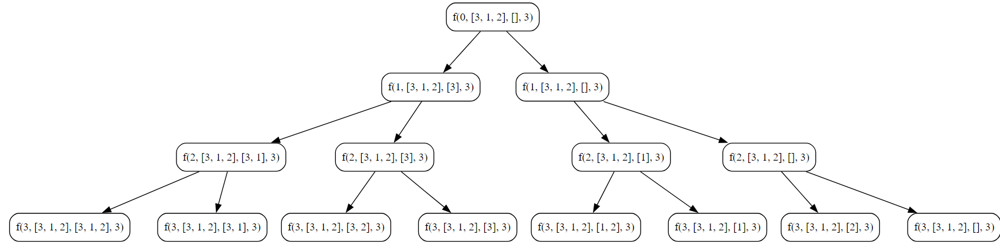

# Subsequence's

In the context of a list (or an array) in data structures and algorithms, a subsequence is a sequence of elements that appears in the same order as the original sequence but not necessarily consecutively. In other words, a subsequence is a subset of elements obtained by deleting some elements from the original sequence without changing the relative order of the remaining elements.

For example, consider the list `[1, 2, 3, 4]`. The following are some of its subsequence's:

- `[1, 2, 3, 4]`
- `[1, 3, 4]`
- `[2, 4]`
- `[1, 2, 4]`
- ...

Note that each subsequence is obtained by selecting a subset of elements from the original list while maintaining their relative order. The length of a subsequence can vary from 0 (empty subsequence) to the length of the original sequence.


### Objective

Implement an algorithm to find and print all possible subsequence's of a given array.

**Key Steps**

1. **Initialization**
    
    - Initialize an array, `arr`, with elements `[3, 1, 2]`.
    - Initialize an empty array, `blank_arr`, to store the subsequence's.
    - Determine the length of the array, `n`.
2. **Subsequence Generation Algorithm**
    
    - Call the `getSubsequences` function, passing the array, initial index (`0`), empty array, and length of the array.
    - The objective is to find and print all possible subsequence's of the given array.
3. **Generate Subsequence's**
    
    - In the `getSubsequences` function, if the current index `i` is greater than or equal to the length of the array, print the current subsequence stored in `blank_arr` and return.
    - The recursive calls explore two possibilities: including the current element in the subsequence (take) and not including it (not take).
4. **Take Element Case**
    
    - Include the current element in the subsequence by appending it to `blank_arr`.
    - Recursively call the `getSubsequences` function with the next index (`i+1`).
5. **Pop Operation (Backtrack)**
    
    - Remove the last element from `blank_arr` to backtrack and explore other possibilities.
6. **Not Take Element Case**
    
    - Recursively call the `getSubsequences` function without including the current element in the subsequence.


### Code
**Go**
```go
package subseq

import (
	"fmt"
)

func SubSeq() {
	fmt.Println("Tutorial for Subsequence")
	var arr = []int{3, 1, 2}
	var blank_arr []int
	length := len(arr)

	getSubsequences(0, &arr, &blank_arr, length)
}

func getSubsequences(i int, arr *[]int, blank_arr *[]int, n int) {

	if i >= n {
		fmt.Println((*blank_arr))
		return
	}

	// take or pick the paritcular index into the subsequence
	*blank_arr = append(*blank_arr, (*arr)[i])
	getSubsequences(i+1, arr, blank_arr, n)

	// pop operation
	*blank_arr = (*blank_arr)[:len(*blank_arr)-1]

	// not pick or not take condtion, this element is not added to your subsequence
	getSubsequences(i+1, arr, blank_arr, n)
}
```

**Output**
```
Tutorial for Subsequence
[3 1 2]
[3 1]
[3 2]
[3]
[1 2]
[1]
[2]
[]
```

**Python**
```python
def get_subsequence(i, arr, blank_arr, n):
    if i >= n:
        print(blank_arr)
        return

    blank_arr.append(arr[i])

    get_subsequence(i+1, arr, blank_arr, n)

    blank_arr.pop()

    get_subsequence(i+1, arr, blank_arr, n)


arr = [3, 1, 2]
blank_arr = []
length = len(arr)

get_subsequence(0, arr, blank_arr, length)
```

**Output**
```
[3, 1, 2]
[3, 1]
[3, 2]
[3]
[1, 2]
[1]
[2]
[]
```
### Algorithmic Complexity Analysis
#### Time Complexity
The time complexity of the provided code can be analyzed as follows:

- **Generating Subsequence's:**
  - The `getSubsequences` function is called for each element in the array, and for each element, two recursive calls are made (take and not take).
  - The number of recursive calls is \(2^n\), where \(n\) is the length of the array. This is because, for each element, there are two choices (include or exclude).
  - Each recursive call involves constant-time operations.

Therefore, the overall time complexity is exponential, \(O(2^n)\), where \(n\) is the length of the array.

#### Space Complexity
The space complexity is influenced by the recursive call stack and the space used for the temporary array (`blank_arr`):

- **Recursive Call Stack:**
  - The depth of the recursion is at most \(n\) (the length of the array). Each recursive call consumes a constant amount of space on the call stack.
  - Therefore, the space used by the call stack is \(O(n)\).

- **Temporary Array:**
  - The size of the temporary array (`blank_arr`) can be at most \(n\) elements (when all elements are included in a subsequence).
  - Therefore, the space used by the temporary array is \(O(n)\).

Combining both contributions, the overall space complexity is \(O(n)\).

In summary:
- **Time Complexity:** \(O(2^n)\)
- **Space Complexity:** \(O(n)\)

### Recursion Tree
