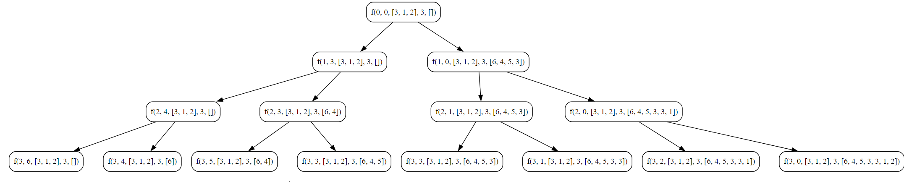

## Subset Sum 1

**Given a list (arr) of N integers, print sums of all subset in it. Output should be printed in increasing order of sums.**

**Example**
```
Input:
N = 2
Arr = [2,3]

Output:
0 2 3 5

Explanation:
When no elements is taken then Sum = 0.
When only 2 is taken then Sum = 2.
When only 3 is taken then Sum = 3.
When element 2 and 3 are taken then Sum = 2 + 3 = 5.

```

### Objective
 - Generate all possible subset sums of an array using recursion.

**Key Steps**

1. **Initialization**
    
    - Initialize an array, `arr`, with elements `[3, 1, 2]`.
    - Initialize an empty slice, `sumArr`, to store subset sums.
2. **Base Case**
    
    - If the current index `ind` equals the length of the array `n`, append the current sum to `sumArr`.
    - The base case captures the sum of elements in each subset.
3. **Recursive Exploration**
    
    - Pick the current element at index `ind`.
    - Recursively call the function with the updated index, updated sum, array, length, and result slice.
    - Do not pick the current element.
    - Recursively call the function without including the current element.
4. **Result**
    
    - Print the original array `arr`.
    - Print the resulting slice `sumArr` containing all subset sums.
    - Sort the subset sums using a quicksort algorithm.
    - Print the sorted `sumArr`.

### Code
**Go**
```go
package subseq

import (
	"fmt"
)

func SubSetSum1() {
	fmt.Println("Tutorial for SubSetSum 1")
	var arr = []int{3, 1, 2}
	var length int = len(arr)
	var sumArr []int

	// Calling function
	doSubSetSum1(0, 0, &arr, length, &sumArr)

	fmt.Println("Input Array : ", arr)
	fmt.Println("Sum Sub Set Array : ", sumArr)

	DoQuickSort(&sumArr, 0, len(sumArr)-1)

	fmt.Println("After Sorting : ", sumArr)
}

func doSubSetSum1(ind int, sum int, arr *[]int, n int, sumArr *[]int) {
	if ind == n {
		(*sumArr) = append((*sumArr), sum)
		return
	}

	// pick the element
	doSubSetSum1(ind+1, sum+(*arr)[ind], arr, n, sumArr)

	// Do-not pick the element
	doSubSetSum1(ind+1, sum, arr, n, sumArr)

}
```

**Output:**
```
Tutorial for SubSetSum 1
Input Array :  [3 1 2]
Sum Sub Set Array :  [6 4 5 3 3 1 2 0]
After Sorting :  [0 1 2 3 3 4 5 6]
```

---

**Python**
```Python
def do_subset_sum1(ind, sum, arr, n, sumArr ):
    if ind == n:
        sumArr.append(sum)
        return
    
    do_subset_sum1(ind+1, sum+arr[ind], arr, n, sumArr)
    do_subset_sum1(ind+1, sum, arr, n, sumArr)


arr = [3,1,2]
sumArr = []
do_subset_sum1(0,0,arr,len(arr), sumArr)
print(sumArr)
```

**Output:**
```
[6, 4, 5, 3, 3, 1, 2, 0]
```

### Algorithmic Complexity Analysis

#### Time Complexity

The time complexity of the `doSubSetSum1` function can be analyzed as follows:
- The function is called twice for each element in the array, once including the element and once excluding it.
- For each call, the function makes two recursive calls with a reduced problem size.
- The total number of recursive calls made by the function is \(2^n\), where \(n\) is the length of the input array.

Therefore, the time complexity of the given code is exponential and can be expressed as \(O(2^n)\), where \(n\) is the length of the input array.
#### Space Complexity

The space complexity is determined by the space used in the function call stack and the auxiliary space for the `sumArr` slice.
- The depth of the recursion is at most equal to the length of the input array \(n\).
- In each recursive call, a new frame is added to the call stack, consuming space proportional to \(n\).
- The `sumArr` slice stores the subset sums and can potentially grow to contain \(2^n\) elements in the worst case.

Therefore, the space complexity can be expressed as \(O(n) + O(2^n)\), where \(n\) is the length of the input array.

**In summary**
- Time Complexity: \(O(2^n)\)
- Space Complexity: \(O(n) + O(2^n)\)
### Recursion Tree


