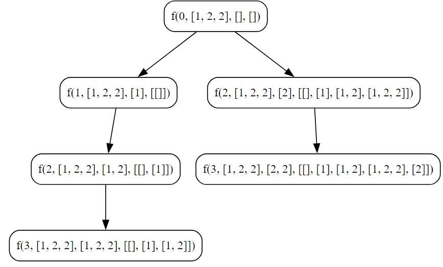
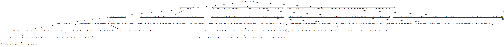

## Subset Sum 2

**Given an integer array `nums` that may contain duplicates, return all possible subsets (the power set).**

- The solution set **must not** contain duplicate subsets. Return the solution in **any order**.

**Example:**
```
Input: nums = [1,2,2]
Output: [[], [1], [1,2], [1,2,2,], [2], [2,2]]
```

### Objective
- Generate all unique subsets of an array, avoiding duplicate subsets.

**Key Steps**
1. **Initialization**
	-  Initialize an array, `arr`, with elements `[1, 2, 2]`.
	- Initialize an empty 2D slice, `ans`, to store subsets.
	- Initialize an empty slice, `ds`, to represent the current subset.
1. **Base Case**
    
    - Create a copy of the current subset `ds` and append it to `ans`.
    - The base case captures valid subsets and ensures they are unique.
2. **Recursive Exploration**
    
    - Iterate through the array starting from the current index.
    - Skip duplicates to avoid redundant subsets.
    - Add the current element to the subset `ds`.
    - Recursively call the function with the updated index, array, subset, and result.
    - Remove the last element from the subset `ds` to backtrack and explore other possibilities.
3. **Result**
    
    - Print the resulting 2D slice `ans` containing all unique subsets.

### Code

**Go**
```go
package subseq

import (
	"fmt"
)

func SubSetSum2() {
	fmt.Println("Tutorial for SubSetSum 2")

	// var arr = []int{1, 2, 2, 2, 3, 3}
	var arr = []int{1, 2, 2}
	var ans [][]int
	var ds []int

	// Calling function
	doSubSetSum2(0, &arr, ds, &ans)

	fmt.Println("Input Array : ", arr)
	fmt.Println("Sum Array : ", ans)

}

func doSubSetSum2(ind int, arr *[]int, ds []int, ans *[][]int) {
	// Make a copy of ds before appending
	dsCopy := make([]int, len(ds))
	copy(dsCopy, ds)

	(*ans) = append((*ans), dsCopy)

	for i := ind; i < len(*arr); i++ {
		if i != ind && (*arr)[i] == (*arr)[i-1] {
			continue
		}

		// adding element in data structure
		ds = append(ds, (*arr)[i])

		// Calling recursively
		doSubSetSum2(i+1, arr, ds, ans)

		// removing last element from data structure
		ds = ds[:len(ds)-1]

	}
}
```

**Output**
```
Tutorial for SubSetSum 2
Input Array :  [1 2 2]
Sum Array :  [[] [1] [1 2] [1 2 2] [2] [2 2]]
```

**What happen if we use **
```go
func doSubSetSum2(ind int, arr *[]int, ds []int, ans *[][]int) {
	(*ans) = append((*ans), dsCopy)
```

> **Without `copy`**
>
> 1. In Go, a slice is a reference type, meaning that when you assign or pass a slice, you are passing a reference to the underlying array.
> 2. In your original code, when you appended the `ds` slice to `ans`, you were appending a reference to the same underlying array.
> 3. Modifications to the `ds` slice later in the loop were reflected in all previously appended slices in `ans`.
> 4. As a result, all subsets in `ans` ended up being the same, even though they were intended to be different.
> 
> **With `copy`**
> 1. The `copy` function in Go is used to create an independent copy of the elements from one slice to another.
> 2. In the corrected code, `dsCopy` is created as a new slice with the same length as `ds`.
> 3. . `copy(dsCopy, ds)` copies the elements from the `ds` slice to the new `dsCopy` slice.
> 4. By doing this, each subset appended to `ans` is based on an independent copy of `ds`.
> 5. Modifications to the original `ds` slice in the loop do not affect the subsets already appended to `ans`.
> 6. This ensures that each subset in `ans` is distinct and not affected by later modifications to the `ds` slice.

> **Breakdown of the relevant parts:**
```go
dsCopy := make([]int, len(ds))
copy(dsCopy, ds)
```
- `make([]int, len(ds))`: Creates a new slice of integers with the same length as `ds`.
- `copy(dsCopy, ds)`: Copies the elements from the `ds` slice to the new `dsCopy` slice.
---

**Python**
```python
def do_subset_sum2(ind, arr, ds, ans):
    ans.append(ds.copy()) # Append a copy of 'ds' to 'ans'

    for i in range(ind,len(arr)):
        if i != ind and arr[i] == arr[i-1]:
            continue
        
        ds.append(arr[i])

        do_subset_sum2(i+1, arr, ds, ans)

        ds.pop()


arr = [1,2,2]
ans = []
ds = []
do_subset_sum2(0, arr, ds, ans)
print(ans)
```

**Output**
```
[[], [1], [1, 2], [1, 2, 2], [2], [2, 2]]
```


**Additional Example**

- **Input**
```go
func SubSetSum2() {
	fmt.Println("Tutorial for SubSetSum 2")

	var arr = []int{1, 2, 2, 2, 3, 3}
	var ans [][]int
	var ds []int

	// Calling function
	doSubSetSum2(0, &arr, ds, &ans)

	fmt.Println("Input Array : ", arr)
	fmt.Println("Sum Array : ", ans)

}
```

- **Output**
```
Tutorial for SubSetSum 2
Input Array :  [1 2 2 2 3 3]
Sum Array :  [[] [1] [1 2] [1 2 2] [1 2 2 2] [1 2 2 2 3] [1 2 2 2 3 3] [1 2 2 3] [1 2 2 3 3] [1 2 3] [1 2 3 3] [1 3] [1 3 3] [2] [2 2] [2 2 2] [2 2 2 3] [2 2 2 3 3] [2 2 3] [2 2 3 3] [2 3] [2 3 3] [3] [3 3]]
```

### Algorithmic Complexity Analysis
#### Time Complexity
The time complexity is exponential due to the recursive exploration of all possible subsets. Specifically, it is \(O(2^n)\), where \(n\) is the length of the input array. The reason for this is that, for each element in the array, two recursive calls are made (including the element and excluding the element), leading to an exponential growth in the number of function calls.

#### Space Complexity
The space complexity is determined by the space used in the function call stack and the auxiliary space for the subsets stored in the `ans` slice. The depth of the recursion is at most equal to the length of the input array \(n\). Additionally, the `ans` slice can potentially store \(2^n\) subsets in the worst case. Therefore, the space complexity is \(O(n) + O(2^n)\), where \(n\) is the length of the input array.

In summary
- **Time Complexity:** \(O(2^n)\)
- **Space Complexity:** \(O(n) + O(2^n)\)
### Recursion Tree


