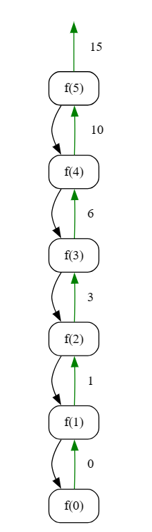

## Sum of n

### Objective

Implement an algorithm to calculate the sum of the first \( n \) natural numbers recursively.

**Key Steps**

1. **Initialization**
   - Set the value of \( n \) for which the sum is to be calculated (e.g., \( n = 5 \)).

2. **Sum Calculation Algorithm**
   - Call the `sumOfn` function, passing the value of \( n \).
   - The objective is to calculate and return the sum of the first \( n \) natural numbers.

3. **Base Case**
   - In the `sumOfn` function, check if \( n \) is equal to 0. If true, return 0 (base case of the sum).

4. **Recursive Addition**
   - If \( n \) is greater than 0, recursively call the `sumOfn` function for \( n-1 \) and add \( n \) to the result.

5. **Return Result**
   - Return the result of the addition as the sum of the first \( n \) natural numbers.

**Note**
- The algorithm assumes a non-negative integer \( n \) for which the sum is calculated.

### Code
**Go**
```go
package subseq

import "fmt"

func SumOfn() {
	fmt.Println("Tutorial for sum of n")

	n := 5
	result := sumOfn(n)
	fmt.Println(result)

}

func sumOfn(n int) int {
	if n == 0 {
		return 0
	}
	return n + sumOfn(n-1)
}
```

**Output**
```
Tutorial for sum of n
15
```

**Python**
```python
def sum_of_n(n):
    if n == 0:
        return 0

    return n + sum_of_n(n-1)


n = 5
print(sum_of_n(n))
```

```
15
```
### Algorithmic Complexity Analysis
#### Time Complexity
The time complexity of the provided code can be analyzed as follows:

- **Recursive Calls**
  - The `sumOfn` function makes a series of recursive calls until reaching the base case (\(n == 0\)).
  - The number of recursive calls is proportional to the value of \(n\).

Therefore, the overall time complexity is \(O(n)\), where \(n\) is the input value for which the sum is calculated.

#### Space Complexity
The space complexity is influenced by the depth of the recursive call stack:

- **Recursive Call Stack**
  - The depth of the recursion is at most \(n\), corresponding to the value of \(n\) in the sum calculation.
  - Each recursive call consumes a constant amount of space on the call stack.

Therefore, the overall space complexity is \(O(n)\), where \(n\) is the input value for which the sum is calculated.

In summary:
- **Time Complexity:** \(O(n)\)
- **Space Complexity:** \(O(n)\)


### Recursion Tree

